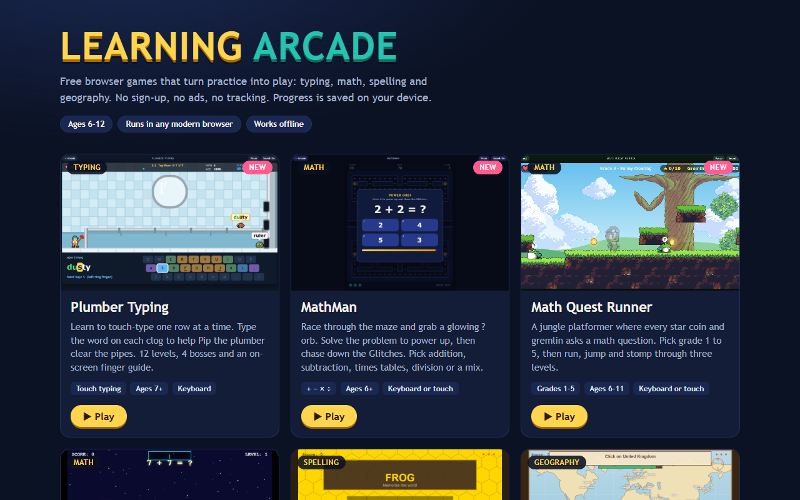
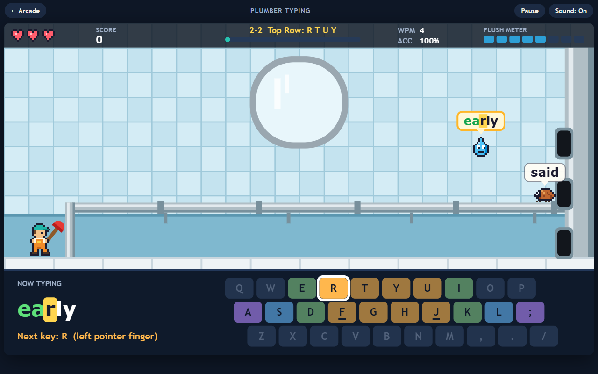
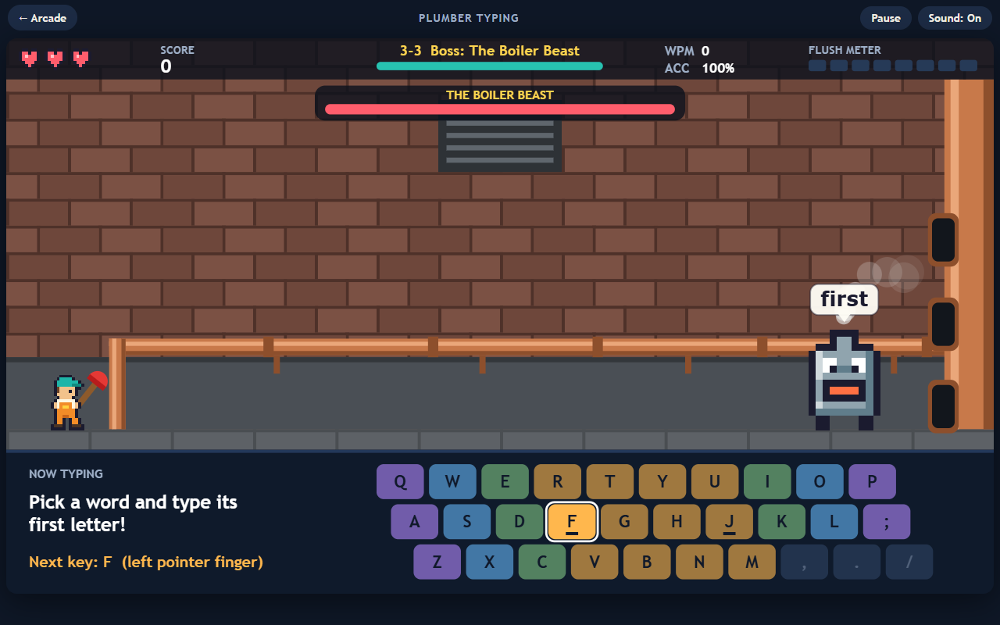
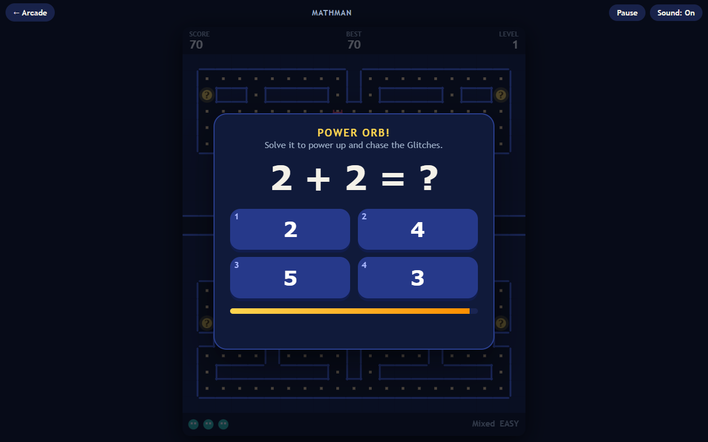
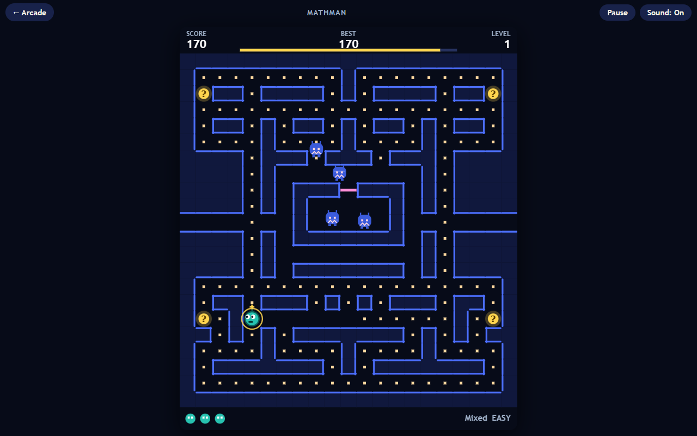
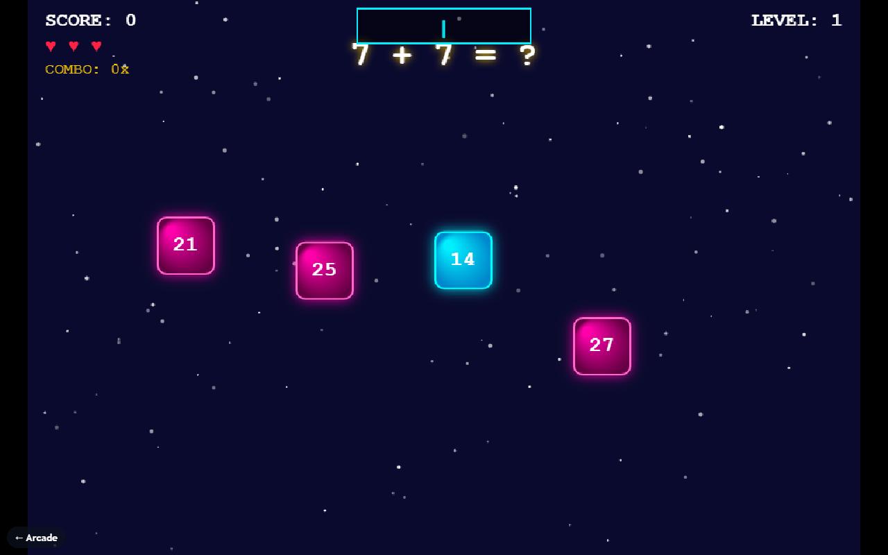
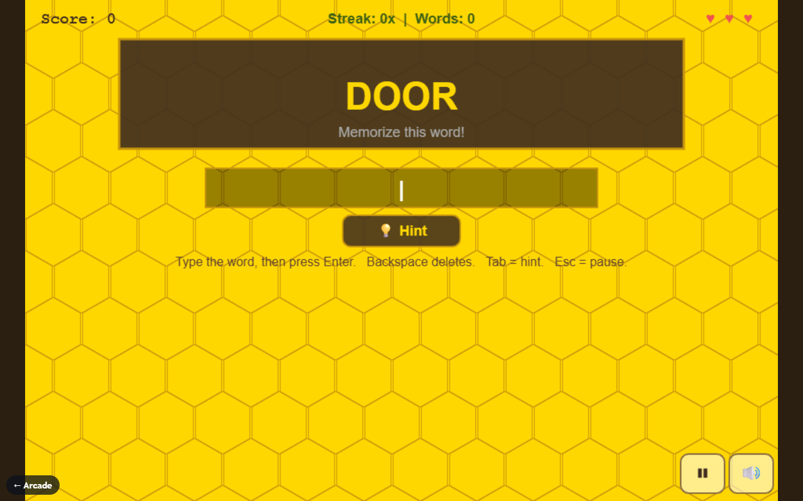
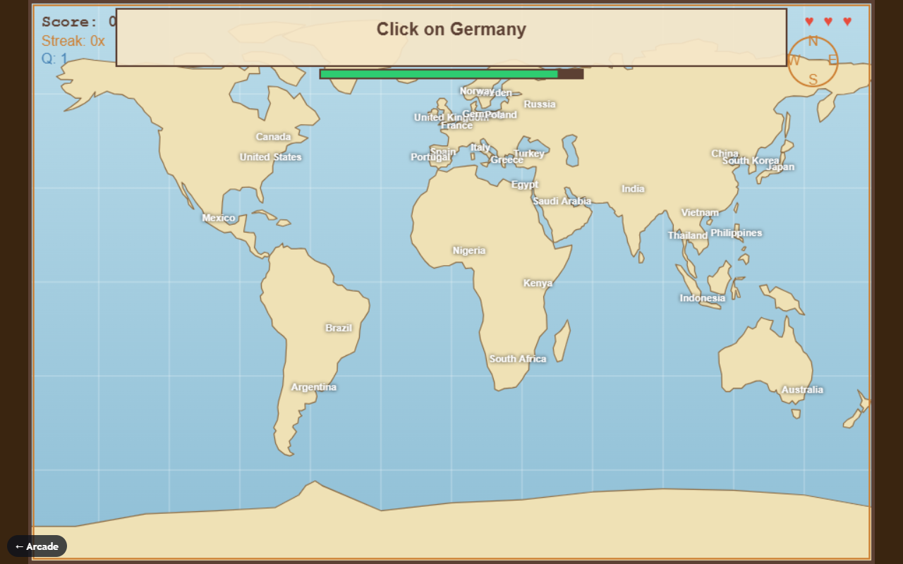

# Learning Arcade

Free browser games that turn practice into play: touch typing, math facts, spelling and geography.
No sign-up, no ads, no tracking. Every game is a single HTML file that runs in any modern browser, even offline.



## Games

| Game | What it practices | Ages | Controls |
|---|---|---|---|
| [Plumber Typing](plumber-typing.html) **(new)** | Touch typing, one keyboard row at a time | 7+ | Keyboard |
| [MathMan](mathman.html) **(new)** | + &minus; &times; &divide; facts inside a maze-chase game | 6+ | Keyboard, swipe or D-pad |
| [Math Blaster](math-blaster.html) | Quick arithmetic with falling answer blocks | 6+ | Keyboard |
| [Spelling Bee](spelling-bee.html) | Spelling: see it, hear it, clues, speed rounds, jumbles | 7+ | Keyboard |
| [GeoQuest](geoquest.html) | Countries, capitals, landmarks and flags on a world map | 8+ | Mouse or touch, plus keyboard |

### Plumber Typing



Help Pip the plumber clear clogged pipes by typing the word on each clog before it reaches him.

- **12 levels in 4 worlds** (Kitchen Sink, Bathroom Pipes, Basement Boiler, Sewer Depths). Each level teaches
  a few new keys and only uses keys you have already learned: home row, then the top row, then the bottom row,
  then speed and long words.
- **On-screen keyboard** lights up the next key in the color of the finger that should press it.
- **Boss every third level.** Each word you finish knocks the boss back.
- **FLUSH meter** fills with every word typed without a mistake. When it is full, press Enter to wash every clog away.
- Words per minute, accuracy, streaks, 1 to 3 stars per level, and saved progress. Speed setting for younger players.



### MathMan



Race through the maze eating dots while four Glitches chase you. Eat a glowing **?** orb and the game pauses
for a math problem:

- **Right answer:** power mode. The Glitches turn blue and you can catch them for bonus points.
- **Wrong answer or time runs out:** you see the correct answer, and the Glitches speed up for a few seconds.
- **Bonus calculators** appear during each maze. Solve their problem to win Freeze, Speed Boots or an extra life.
- Choose **+, &minus;, &times;, &divide; or Mix**, and **Easy** (within 10, tables to 5), **Medium** (within 20,
  tables to 10) or **Hard** (two-digit numbers, tables to 12). Best score is saved for each choice.



### Math Blaster, Spelling Bee and GeoQuest

| Math Blaster | Spelling Bee | GeoQuest |
|---|---|---|
|  |  |  |

## Play locally

```bash
git clone https://github.com/Zaarnno-Dev-Hub-dot/zaarno-learning-arcade.git
cd zaarno-learning-arcade
python -m http.server 8000
```

Then open http://localhost:8000. You can also double-click any `.html` file to open it directly in a browser.

## Privacy

The games make no network requests and use no accounts, cookies, analytics or third-party scripts.
Scores and progress are stored only in your browser's `localStorage`.

## For developers

- Each game is one self-contained file: inline CSS and JavaScript, art drawn in code, sound from the Web Audio API.
- `plumber-typing.html?debug` and `mathman.html?debug` expose a small `window.__plumber` / `window.__mathman`
  object for automated play-testing.
- `node tools/capture-screenshots.mjs` regenerates everything in `docs/screenshots/` with headless Chrome or Edge
  (Node 22+, no npm install needed). Serve the folder on port 8765 first:
  `python -m http.server 8765 --bind 127.0.0.1`.

## License

MIT. See [LICENSE](LICENSE) and [CREDITS.md](CREDITS.md).